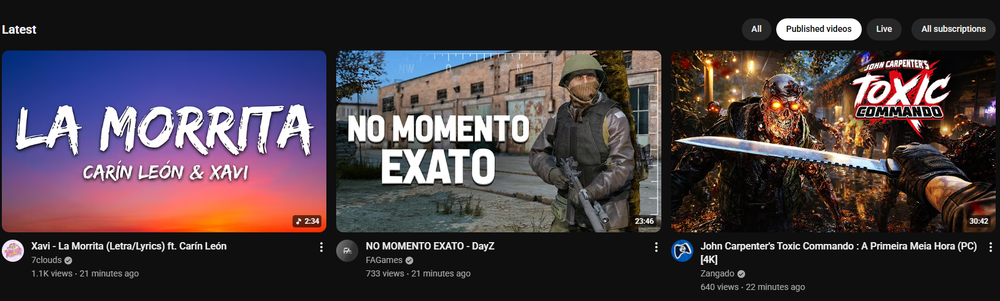

# YouTube Subscriptions Filter

Chrome extension that adds filter chips on the YouTube subscriptions page:

- `All`
- `Published videos`
- `Live`

Default mode is `Published videos`, which hides live, upcoming, and streamed-live entries.

## Screenshots

### Published videos

### Live

## Install (Unpacked)

1. Open `chrome://extensions`
2. Enable `Developer mode`
3. Click `Load unpacked`
4. Select this folder

## How it handles infinite scroll

YouTube subscriptions feed is loaded incrementally while the user scrolls.  
This extension handles that by combining:

- `MutationObserver` on the feed container (`#contents`) to catch newly inserted cards.
- A queued re-filter pass via `requestAnimationFrame` to avoid over-processing on rapid updates.
- YouTube SPA navigation hooks (`yt-navigate-finish` + history hooks) to rebind observers when route changes.

Classification is language-independent and combines:

- Structural live indicators in the video card/thumbnail (live/upcoming overlays and badges).
- Cached video-level checks via YouTube internal `youtubei/v1/player` endpoint by `videoId`.

So every newly loaded item is hidden/shown according to the selected mode regardless of UI locale.

## Debug logs

Open DevTools Console on YouTube to inspect logs with prefix:

- `[YT Subs Filter]`

Examples:

- Script startup and navigation hooks.
- Observer attach/detach.
- Filter mode changes.
- Filter apply summary (`mode`, `total`, `lives`, `hidden`, `unknown`).

If you want to silence logs, set `DEBUG` to `false` in `content.js`.

`DEBUG` is `false` by default for production usage.
